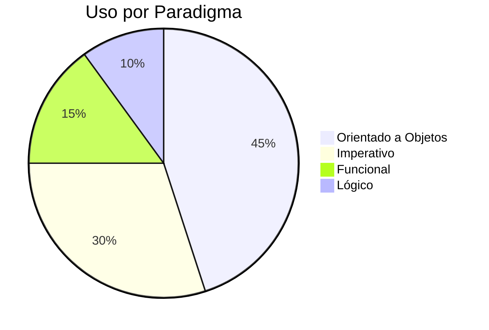

# S01 - Paradigmas da Programação 💻

Repositório dedicado ao estudo prático dos principais paradigmas de programação.

## 📌 Visão Geral  
- **Paradigmas:**    
- **Linguagens:** 10 
- **Exercícios:** 11 conjuntos

---

## 🗂 Estrutura dos Exercícios

### 🏗️ Paradigma Imperativo
   

### 🧩 Paradigma OO
   

### 🔍 Paradigma Lógico

### λ Paradigma Funcional
 

---

## 📊 Estatísticas Avançadas

### 🌐 Distribuição de Linguagens

